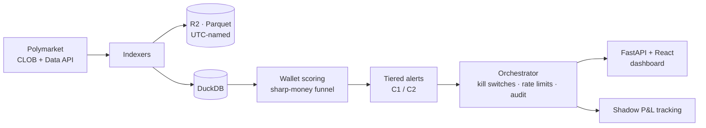

# polybot — Polymarket Signals Bot

> A signals-only quantitative bot for [Polymarket](https://polymarket.com): it indexes the order book, tracks sharp-money wallets, and surfaces informed-trading alerts to a human. **No auto-execution** — every trade decision stays with the operator.
>
> *Un bot quantitatif « signals-only » pour Polymarket : il indexe le carnet d'ordres, suit les wallets « sharp money » et remonte des alertes de trading informé à un humain. **Aucune exécution automatique** — chaque décision de trade reste à l'opérateur.*

> **Personal project.** This repo documents the architecture and engineering; credentials, wallet lists, and live data are not published.
>
> *Projet personnel — ce dépôt documente l'architecture et l'ingénierie ; identifiants, listes de wallets et données live ne sont pas publiés.*

**Status / Statut :** M8–M10 deployed · dashboard v2 live · running on a VPS.

---

## 🇬🇧 English

### What it does

A daemon continuously ingests Polymarket data and turns it into ranked, human-reviewed signals:

- **CLOB indexing** — periodic order-book snapshots stored as Parquet on Cloudflare R2, timestamped in UTC for reliable correlation.
- **Sharp-money tracking** — a wallet-scoring funnel (tens of thousands of wallets → filtered → scored on win-rate and P&L) surfaces a short list of consistently profitable "smart money" accounts to follow.
- **Informed-trading alerts** — tiered alerts (C1/C2) on meaningful order-book and on-chain moves, rate-limited and delivered for human review — never auto-traded.
- **Shadow performance** — alerts are tracked as if traded, so signal quality is measured without risking capital.
- **Web dashboard** — a "trading terminal" style UI (Overview, Alerts, Wallets, Performance, System) served by an embedded FastAPI backend behind Caddy.

### Engineering highlights

- **Human-in-the-loop by design.** The bot never executes; it ranks and alerts. Capital risk is a deliberate non-goal of the current phases.
- **Operational safety rails.** A central orchestrator adds **kill switches** (per-channel + global), centralized **rate limits**, **circuit breakers** (indexer-health auto-kill, LLM cost cap, disk usage), and a persisted **audit log**.
- **UTC-everywhere discipline.** DB timestamps and R2 file names are all UTC; only VPS logs show local time — normalized on read (see ADR-012). Timezone bugs are designed out, not patched.
- **Clean prod/research split.** Production code (`src/polybot`) is isolated from exploratory notebooks and research scripts, so the daemon stays lean while analysis iterates freely.
- **Reproducible env.** Python 3.13 + `uv` with a committed lockfile; DuckDB for local analytical queries, R2 (S3-compatible) for durable storage.

### Architecture



### Tech stack

Python 3.13 · `uv` · DuckDB · Cloudflare R2 (S3-compatible) · FastAPI + React (SWR, Tailwind v4) · Caddy · systemd on a VPS · pydantic-settings.

---

## 🇫🇷 Français

### Ce que ça fait

Un daemon ingère en continu les données Polymarket et les transforme en signaux classés, revus par un humain :

- **Indexation CLOB** — snapshots périodiques du carnet d'ordres stockés en Parquet sur Cloudflare R2, horodatés en UTC pour une corrélation fiable.
- **Suivi du « sharp money »** — un funnel de scoring de wallets (des dizaines de milliers → filtrés → notés sur win-rate et P&L) fait remonter une short list de comptes « smart money » régulièrement profitables à suivre.
- **Alertes de trading informé** — alertes à niveaux (C1/C2) sur les mouvements significatifs du carnet et on-chain, rate-limitées et livrées pour revue humaine — jamais auto-tradées.
- **Performance shadow** — les alertes sont suivies comme si elles étaient tradées : la qualité du signal est mesurée sans risquer de capital.
- **Dashboard web** — une UI style « terminal de trading » (Overview, Alerts, Wallets, Performance, System) servie par un backend FastAPI embarqué derrière Caddy.

### Points d'ingénierie notables

- **Human-in-the-loop par conception.** Le bot n'exécute jamais ; il classe et alerte. Le risque de capital est un non-objectif assumé des phases actuelles.
- **Garde-fous opérationnels.** Un orchestrateur central ajoute des **kill switches** (par canal + global), des **rate limits** centralisés, des **circuit breakers** (auto-kill sur santé des indexers, plafond de coût LLM, usage disque) et un **audit log** persisté.
- **Discipline UTC partout.** Timestamps DB et noms de fichiers R2 tous en UTC ; seuls les logs VPS affichent l'heure locale — normalisée à la lecture (voir ADR-012). Les bugs de fuseau sont éliminés par conception, pas rustinés.
- **Séparation prod/recherche nette.** Le code de prod (`src/polybot`) est isolé des notebooks exploratoires et scripts de recherche : le daemon reste léger pendant que l'analyse itère librement.
- **Env reproductible.** Python 3.13 + `uv` avec lockfile commité ; DuckDB pour les requêtes analytiques locales, R2 (compatible S3) pour le stockage durable.

### Stack technique

Python 3.13 · `uv` · DuckDB · Cloudflare R2 (compatible S3) · FastAPI + React (SWR, Tailwind v4) · Caddy · systemd sur VPS · pydantic-settings.

---

## Setup

### Prerequisites / Prérequis

- Python 3.13+ and [`uv`](https://docs.astral.sh/uv/)
- Cloudflare R2 account (free tier)
- US VPN (Polymarket APIs are geo-blocked from the EU / *les APIs Polymarket sont géo-bloquées depuis l'UE*)

### Install

```bash
git clone <repo-url>
cd polybot
cp .env.example .env          # add your R2 credentials
uv sync --extra dev
uv run python scripts/init_db.py
```

### Run a CLOB snapshot

```bash
uv run python -m polybot.indexers.clob_snapshot refresh-universe
uv run python -m polybot.indexers.clob_snapshot snapshot
uv run python scripts/validate_snapshot.py
```

### Tests

```bash
uv run pytest tests/unit/ -v                    # unit
uv run pytest tests/ -v -m integration          # integration (needs .env + VPN)
```

## Project structure

```
src/polybot/       Production code
  config.py          Settings via pydantic-settings (.env)
  db/                DuckDB migrations
  storage/           R2 (S3-compatible) client
  indexers/          Data ingestion (CLOB snapshots, etc.)
research/          Research scripts (separate from prod)
migrations/        SQL migration files
scripts/           CLI utilities
tests/             Unit + integration tests
config/            YAML config (wallets, thresholds)
docs/              Architecture, ADRs, plans
```

### Timezone conventions

DuckDB timestamps and R2 file names (`snapshots/YYYY-MM-DD/HH.parquet`) are UTC; VPS systemd logs show local time. Always normalize to UTC when correlating — see [ADR-012](docs/ADRs/012_utc_timestamps_r2_naming.md).

---

*Repository maintained by [Gabriel Savean](https://github.com/Gabsavage).*
